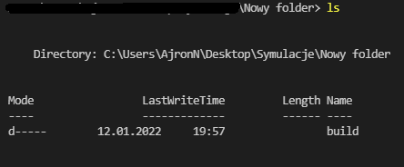

# ForestOnFire

### Description

Project of a cellular automaton simulating a forest fire with a lake in mind.

### Run

Simple way

[https://ajronn.github.io/](https://ajronn.github.io/)

Extended way

You have to install Node.js [https://nodejs.org/en/](https://nodejs.org/en/)

Download build folder. Open f.e. in VS Code.

You have to be on parent directory:

In terminal:

npm install -g serve

serve -s build

